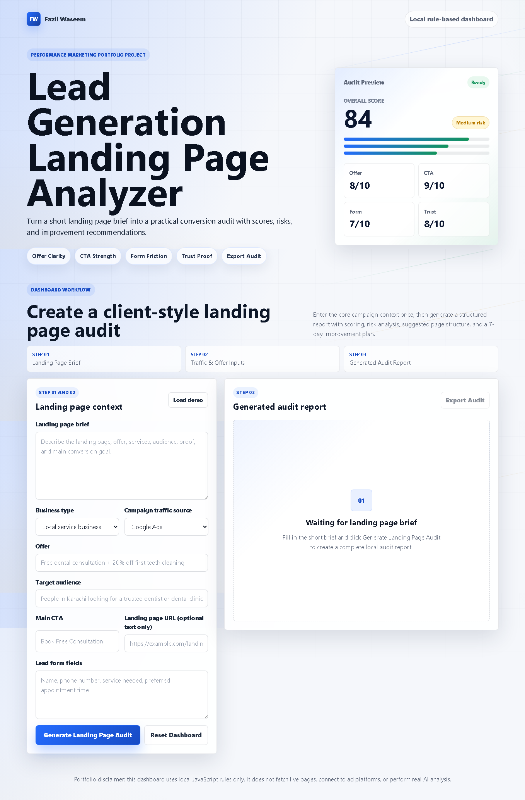

# Lead Generation Landing Page Analyzer

A polished frontend dashboard that turns a short landing page brief into a practical lead generation audit report with scores, risks, recommendations, and a 7-day improvement plan.

Live demo placeholder:
https://fazilprojects.github.io/lead-generation-landing-page-analyzer/

## Screenshot



## Project Purpose

This is a portfolio project for Fazil Waseem, an aspiring Performance Marketer learning Google Ads, Meta Ads, lead generation, ecommerce marketing, conversion rate optimization, landing page optimization, and AI-assisted marketing systems.

The project is intentionally honest: it is not a real AI platform, not a real CRO software product, and does not connect to external APIs, live landing pages, Google Ads, Meta Ads, analytics tools, or tracking software.

## What It Does

Users enter a landing page brief, business type, traffic source, offer, target audience, CTA, and lead form fields. The dashboard then generates a local rule-based audit report covering conversion score, hero messaging, offer clarity, CTA strength, trust proof, form friction, mobile readiness, conversion risks, suggested improvements, revised page structure, and a 7-day action plan.

## Key Features

- Local JavaScript scoring logic
- Business type and traffic source based recommendations
- Overall conversion score out of 100
- Score cards for offer clarity, CTA strength, trust proof, form friction, mobile readiness, and conversion focus
- Hero section, offer, CTA, trust, form, and mobile audit sections
- Conversion risk analysis with priority levels
- Revised landing page section order
- 7-day landing page improvement plan
- Exportable text audit report
- Responsive premium dashboard UI
- GitHub Pages compatible static files

## Test Example

Use this demo scenario:

- Business: Bright Dental Studio
- Business type: Local service business
- Campaign source: Google Ads
- Offer: Free dental consultation + 20% off first teeth cleaning
- Target audience: People in Karachi looking for a trusted dentist or dental clinic
- Main CTA: Book Free Consultation
- Lead form fields: Name, phone number, service needed, preferred appointment time
- Landing page brief: A local dental clinic landing page focused on teeth cleaning, whitening, emergency dental care, and family dental services.

## Tech Stack

- HTML
- CSS
- Vanilla JavaScript
- No frameworks
- No external APIs

## Folder Structure

```text
lead-generation-landing-page-analyzer/
├── index.html
├── style.css
├── script.js
├── README.md
├── AGENTS.md
└── docs/
    ├── PROJECT_BRIEF.md
    ├── DESIGN_SYSTEM.md
    └── CONTENT.md
```

## How To Run Locally

Open `index.html` directly in a browser.

No build step, package install, API key, or server is required.

## Portfolio Positioning

This project demonstrates practical thinking around lead generation, landing page optimization, performance marketing workflows, conversion rate optimization, and rule-based AI-style marketing assistance while staying transparent about its limitations.

## Future Improvements

- Add saved audit history in localStorage
- Add printable PDF styling
- Add more business-specific recommendation templates
- Add optional scoring presets for ecommerce, SaaS, and service pages
- Add a comparison mode for before/after landing page copy
- Add manual score adjustment fields for real client workshops

## Author

Fazil Waseem

Aspiring Performance Marketer focused on Google Ads, Meta Ads, lead generation, ecommerce marketing, CRO, landing page optimization, and AI-assisted marketing systems.
